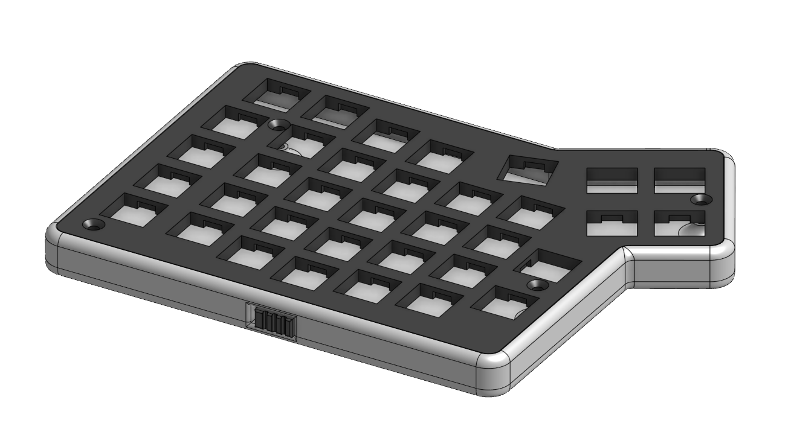

# Neodox Redox keyboard Case
Neodox is just a dumb name for a case for the redox keyboard (both wireless and wired versions) based on looks and getting 'thicness' down as much as possible,  while still being 3d printable.
I also wanted to save space by using the original pcb mounting holes.

## Pics

## Usage guide
There is a calibration tester file (inside the switch_plate_tester folder) you can print with the following tolerances for the switches:
* 0.08 mm
* 0.12 mm
* 0.16 mm
* 0.20 mm

After testing your switches there you can then choose any tolerance on the stls, it's the last number in the name of the top parts

If that's not enough for your printer or want to make any changes just fork this, all files have their asociated step files WITHOUT ANY OFFSETS.

There are also testers in step format form the holes of the microcontroller and trs jacks (so you can test fit before printing and wasting plastic and time) and the alignment of the switches in the redox_w
